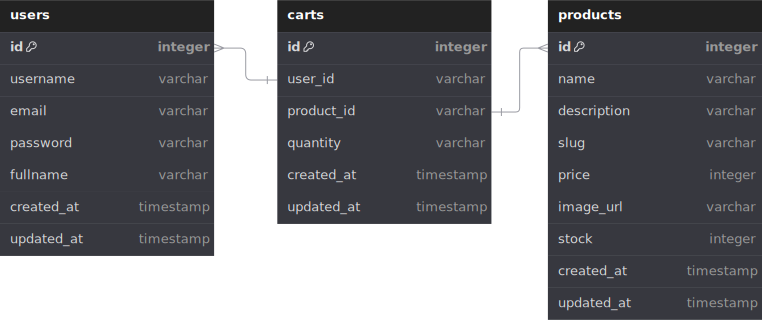

# FLORIS

[Floris](url) is an online store that sells ornamental plants

Table of contents:

- [Floris](#floris)
  - [Links](#links)
  - [Features](#features)
  - [UI Design](#ui-designs)
    - [Home Page](#home-page)
    - [Detail Product](#detail-product)
    - [Cart Page](#cart-page)
    - [Login Page](#login-page)

## Links

- Website/Frontend: <url>
  - Backend: <url>
- Repositories:
  - General: <https://github.com/IQchaidir/floris>
  - Backend: <https://github.com/IQchaidir/floris-backend>
  - Frontend: <https://github.com/IQchaidir/floris-frontend>

Inspirations:

- <https://houseplantshop.com/>

## Features

- Home Page
  - Hero Section
  - Products Catalogue
- Product Page
  - Image
  - SKU (stock keeping until)
  - Name
  - Price
  - Description
  - Add to cart form: quantity input & add to cart button
  - Shopping cart page
- Product items to buy
  - Image, name, price, quantity, total (price x quantity)
  - Remove items
- Link: continue shopping, go to products catalogue
- Link: checkout

## UI Designs

- Figma: <https://www.figma.com/design/yfAIpCewfhMraEFNoXzw6S/Floris?node-id=0-1&node-type=canvas&t=5lyAExTApXagCMPC-0>

### Home Page

### Detail Product

### Cart Page

### Login Page

## Entity Relationship Diagram (ERD)

## REST API Endpoints

- Production: `url`
- Local: `http://localhost:3000`

### API Product

| Endpoint         | HTTP     | Description               |
| ---------------- | -------- | ------------------------- |
| `/products`      | `GET`    | Get all products          |
| `/products/:id`  | `GET`    | Get product by id         |
| `/products/seed` | `POST`   | Seed all initial products |
| `/products`      | `POST`   | Add new product           |
| `/products`      | `DELETE` | Delete all products       |
| `/products/:id`  | `DELETE` | Delete product by id      |
| `/products/:id`  | `PATCH`  | Update product by id      |

### API Auth

| Endpoint           | HTTP     | Permission    | Description                          |
| ------------------ | -------- | ------------- | -------------------------------------|
| `/auth/register`   | `POST`   | Public        | Register User                        |
| `/auth/login`      | `POST`   | Public        | Login User                           |
| `/auth/me`         | `GET`    | Authenticated | Get User Profile                     |
| `/cart`            | `GET`    | Authenticated | Get the current user's cart items    |
| `/cart/items`      | `POST`   | Authenticated | Add new item(s) to the cart          |
| `/cart/items/:id`  | `DELETE` | Authenticated | Remove an item from the cart by ID   |
| `/cart/items/:id`  | `PATCH`  | Authenticated | Update the quantity of an item by ID |
